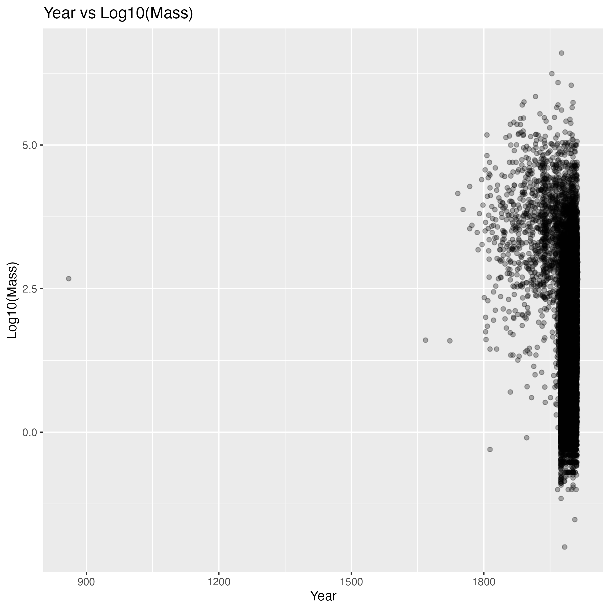
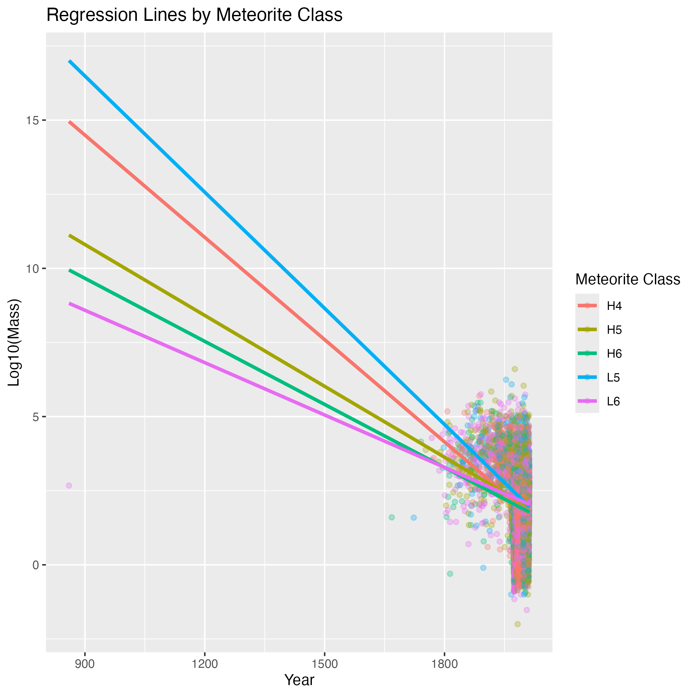
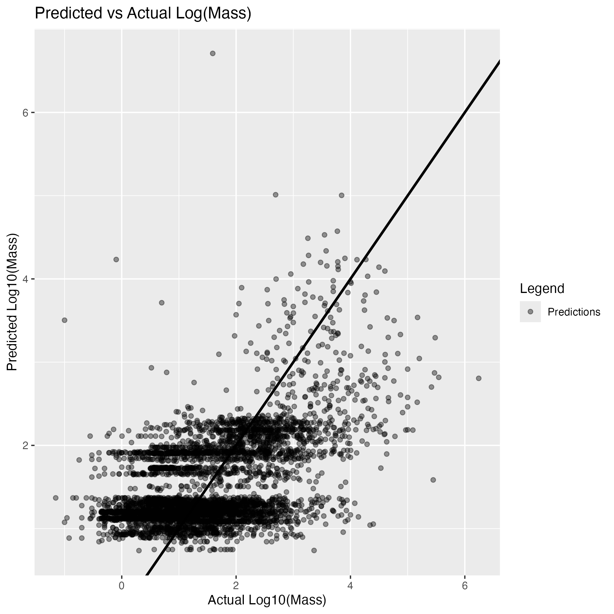

# Summary

This project investigates whether meteorite mass can be predicted using temporal, geographic, and classification features. Using the NASA Meteorite Landings dataset, a linear regression model was trained on cleaned data to predict log-transformed meteorite mass. The model captures general trends in the data but shows limited accuracy for extreme values, suggesting that additional predictors may be required for improved performance.

# Introduction

Meteorites vary widely in size, composition, and geographic distribution. Understanding whether observable characteristics such as time, classification, and location can be used to predict meteorite mass can provide insight into patterns in meteorite discovery and recording.

## Predictive Question

**Can meteorite mass be predicted using year, meteorite classification, geographic location, and fall status?**

## Dataset Description

This analysis uses the NASA Meteorite Landings dataset:

`https://data.nasa.gov/api/views/gh4g-9sfh/rows.csv?accessType=DOWNLOAD`

The dataset includes:

- `mass (g)`: meteorite mass
- `year`: year of observation
- `reclat`, `reclong`: geographic coordinates
- `recclass`: meteorite classification
- `fall`: whether the meteorite was observed falling or found later

# Methods & Results

## Data Loading

The data was downloaded from NASA's public data source using `01_download_meteorite_data.R` and saved to `data/raw/meteorite_landings.csv`.

## Data Wrangling and Cleaning

The dataset was cleaned using `02_clean_meteorite_data.R` by converting variables to appropriate types, removing missing values, excluding non-positive mass values, and retaining only the five most common meteorite classes. A base-10 log transformation was applied to meteorite mass to reduce skewness. The cleaned data was saved to `data/processed/meteorite_landings_clean.csv`.

## Exploratory Visualization

A scatterplot was created to examine the relationship between year and log-transformed meteorite mass.

```{r}
#| fig-cap: "Figure 1. Log10(mass) versus year."

```

## Regression Model

A Gaussian GLM was fit using `04_model_meteorite_data.R` with year, meteorite classification, geographic coordinates, and fall status as predictors, including an interaction between year and meteorite classification:

```
log_mass ~ year * recclass + reclat + reclong + fall
```

The data was split 80/20 into training and testing sets prior to fitting.

## Model Visualization

Regression lines show predicted trends in log-transformed meteorite mass over time for each of the five most common meteorite classes.

```{r}
#| fig-cap: "Figure 2. Regression lines by meteorite class."

```

## Model Evaluation

Predictions from the fitted model were compared against actual log-transformed meteorite mass values in the test set.

```{r}
#| fig-cap: "Figure 3. Predicted versus actual log10(mass) values."

```

# Discussion

The model captures general patterns in meteorite mass using temporal, geographic, and classification variables. However, predictions are not highly accurate, particularly for large meteorites.

This analysis is predictive rather than causal. The results show that while the selected variables help explain variation in meteorite mass, they are not sufficient for highly accurate prediction.

Limitations include:

- High variability in meteorite mass
- Limited predictor variables
- Potential measurement inconsistencies

Future work could explore:

- Additional predictors
- Nonlinear modeling approaches
- Machine learning techniques

# References

NASA Meteorite Landings Dataset. https://data.nasa.gov/

James, G., Witten, D., Hastie, T., & Tibshirani, R. (2021). *An Introduction to Statistical Learning.*

Wickham, H. et al. (2019). Welcome to the tidyverse. *Journal of Open Source Software.*

R Core Team (2023). *R: A Language and Environment for Statistical Computing.*
